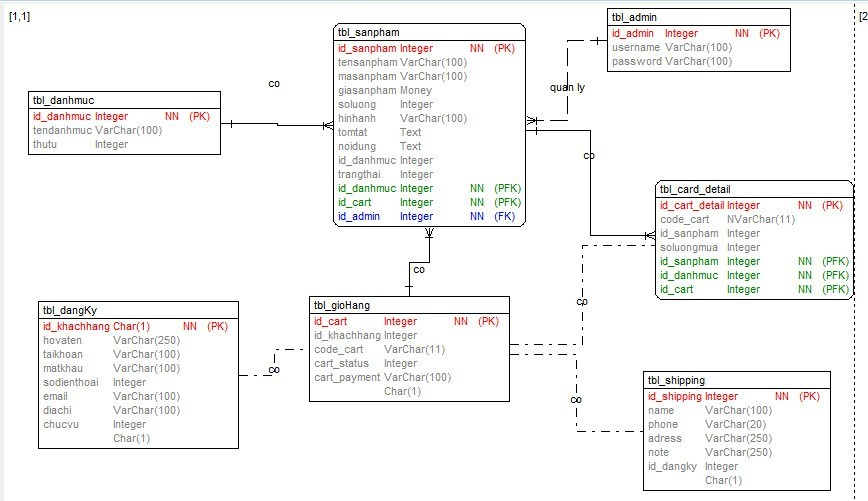
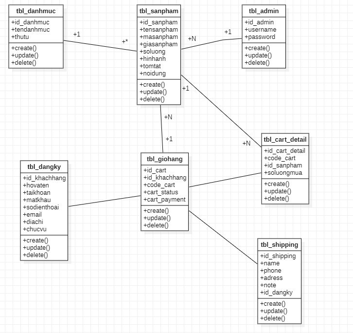
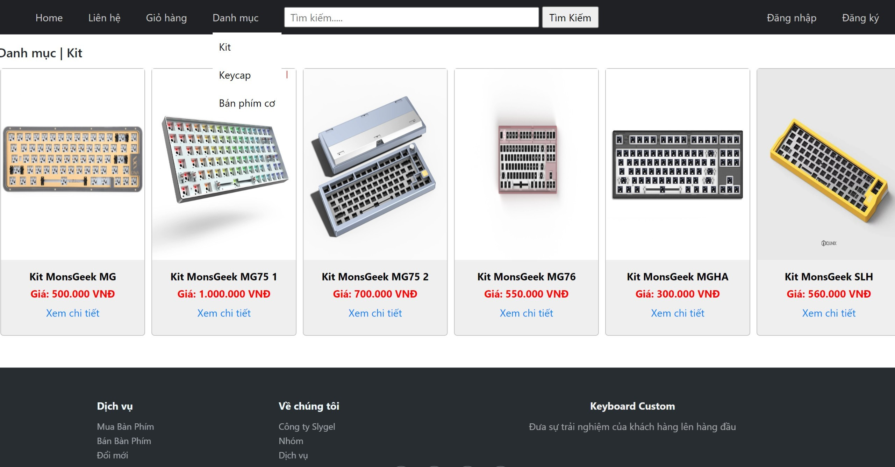
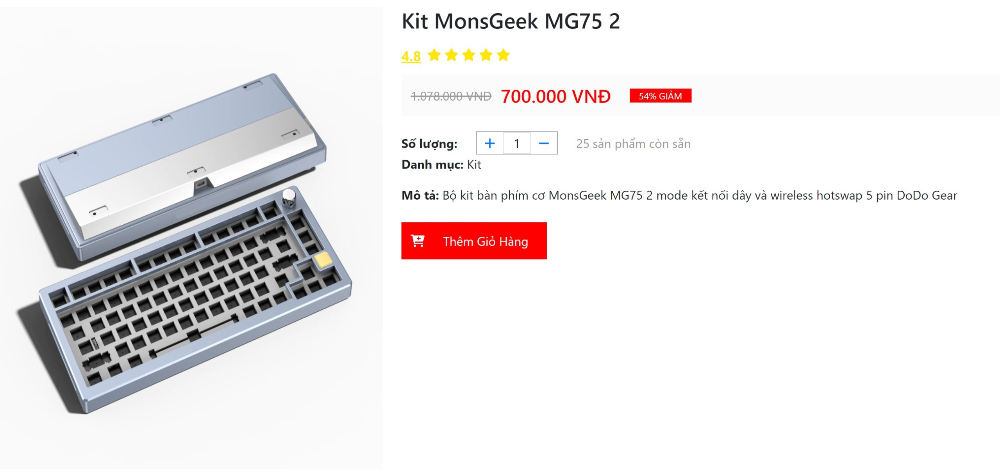
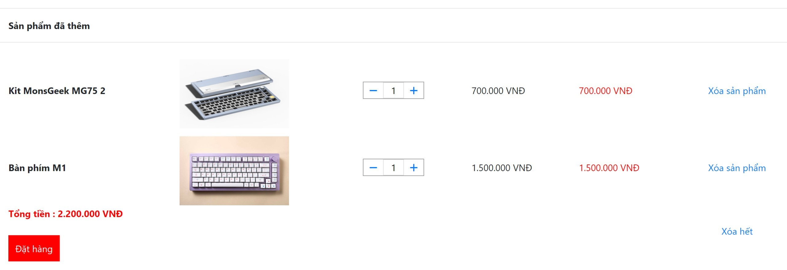
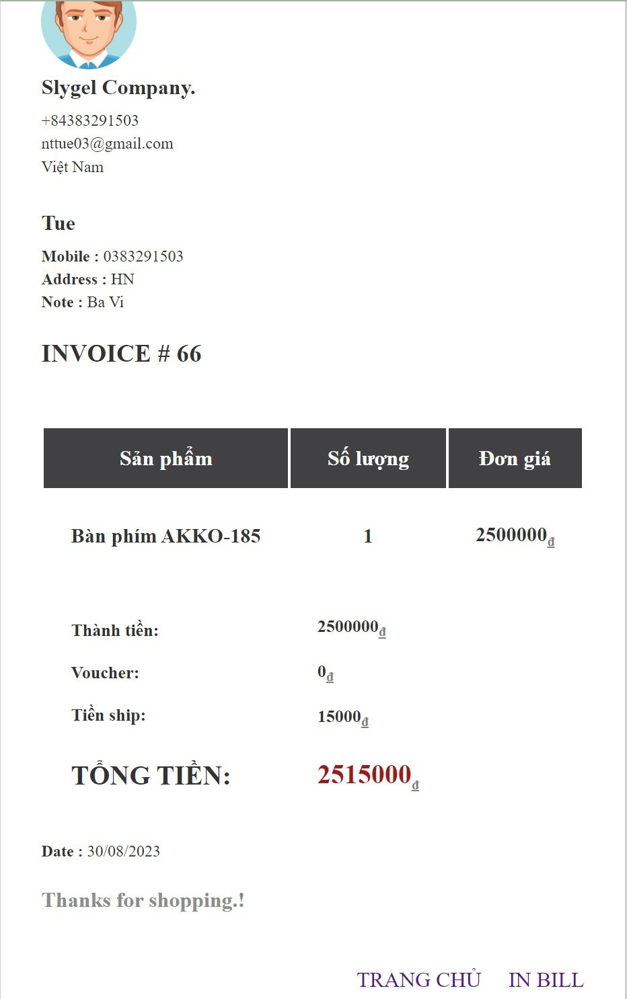
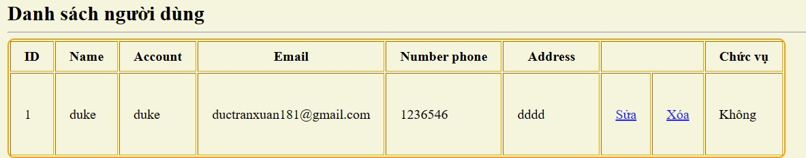
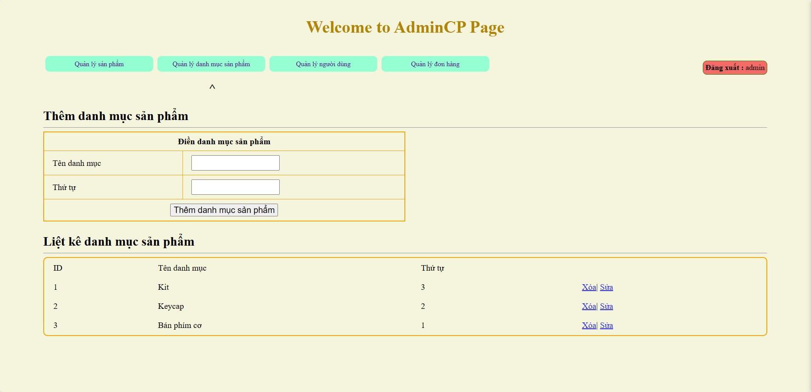
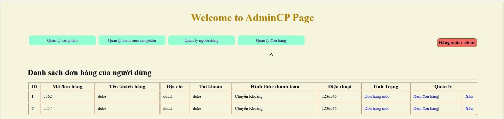
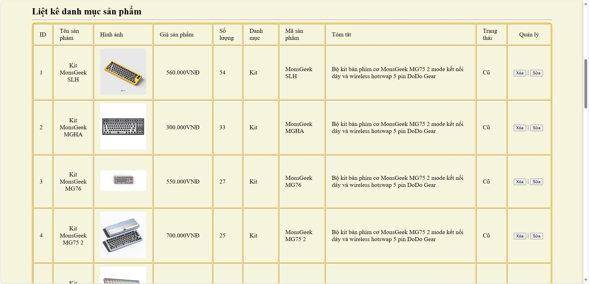

# Bài tập lớn PHP HAUI - 2022

# Website bán bàn phím
## Cơ sở dữ liệu
- *Biểu đồ thực thể ERD*
  
    
- *Biểu đồ các lớp phân tích*

    
## Chức năng
### 1. Người dùng
#### Đăng ký

#### Đăng nhập

#### Xem danh mục sản phẩm

#### Xem chi tiết sản phẩm

#### Thêm vào giỏ hàng

#### Xem hóa đơn

#### Liên hệ với người bán

### 2. Quản trị viên
#### Quản lý người dùng

#### Quản lý danh mục

#### Quản lý đơn hàng

#### Quản lý sản phẩm

## Cài đặt
### Yêu cầu
1. Server
- PHP 8.0
- MySQL 8.0
- XAMPP
2. Client
- HTML/CSS/JavaScript
